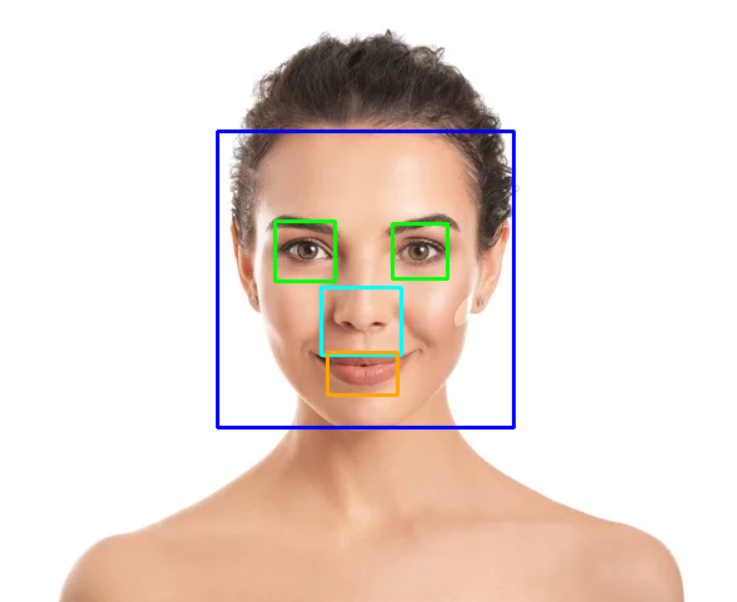

# Yüz Özellikleri Tespiti - OpenCV

Bu proje, bir yüz görüntüsü üzerinde yüz, göz, burun ve ağız gibi temel yüz özelliklerini tespit etmek için OpenCV'nin Haar Cascade sınıflandırıcılarını kullanır.

## Özellikler

- Yüz tespiti (frontal)
- Göz tespiti (gözlük destekli model)
- Burun tespiti
- Ağız tespiti (yüzün alt kısmında, gözlerle çakışmayan ağız seçimi)
- Tespit edilen bölgelerin görsel üzerinde kutucukla gösterimi

## Kullanılan Teknolojiler

- Python
- OpenCV
- Google Colab (görsel gösterimi için `cv2_imshow`)

## Ekran Görüntüsü

Aşağıda, uygulamanın çıktı örneği yer almaktadır:

## Kurulum (Google Colab için)

Bu proje Google Colab ortamında çalıştırılmak üzere tasarlanmıştır. Aşağıdaki adımları takip ederek Colab üzerinde kolayca çalıştırabilirsiniz:

### 1. OpenCV'yi Yükleyin

Google Colab'da genellikle OpenCV önceden yüklüdür. 

Haar Cascade Dosyalarını Projeye Dahil Edin
Aşağıdaki dosyalar yüz ve yüz bileşenlerini tanımak için gereklidir:

| Dosya Adı                             | Açıklama                    |
| ------------------------------------- | --------------------------- |
| `haarcascade_frontalface_default.xml` | ✅ OpenCV ile birlikte gelir |
| `haarcascade_eye_tree_eyeglasses.xml` | ✅ OpenCV ile birlikte gelir |
| `haarcascade_mcs_nose.xml`            | ❗ Manuel olarak indirilmeli |
| `haarcascade_mcs_mouth.xml`           | ❗ Manuel olarak indirilmeli |

